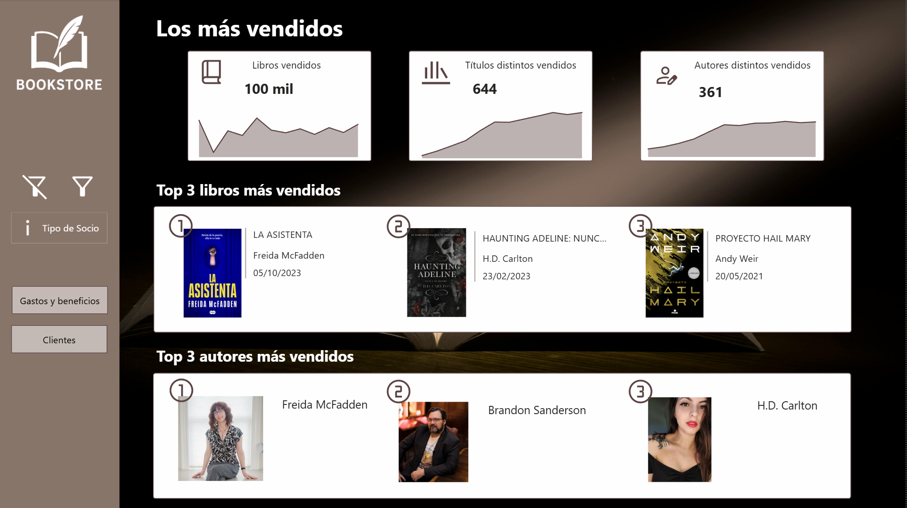
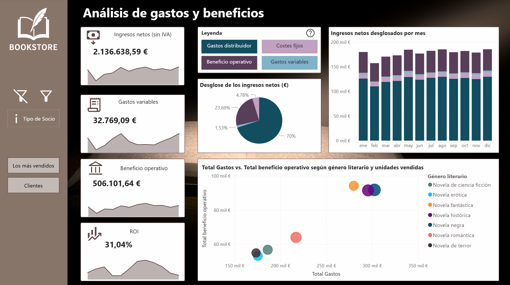
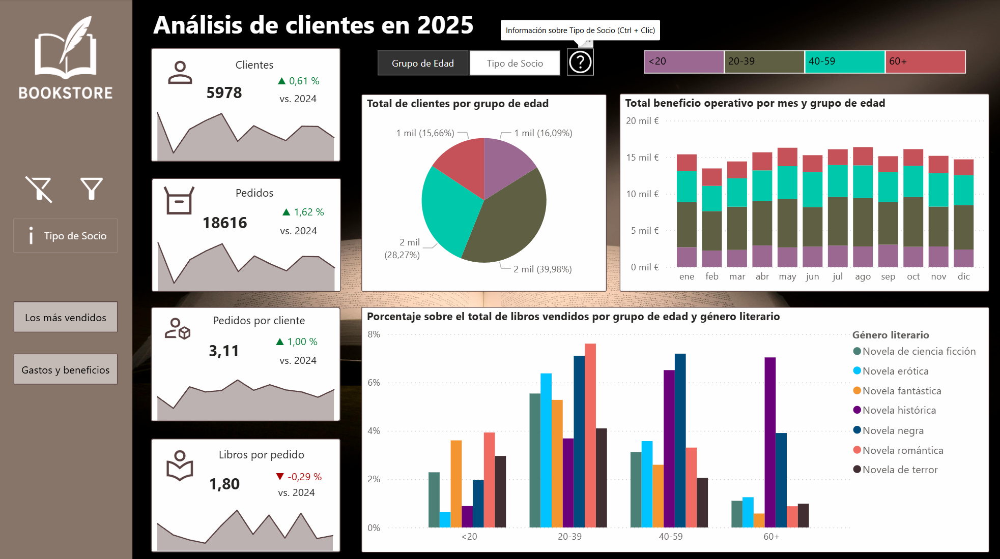

<!-- PROJECT SHIELDS -->
<!--
*** I'm using markdown "reference style" links for readability.
*** Reference links are enclosed in brackets [ ] instead of parentheses ( ).
*** See the bottom of this document for the declaration of the reference variables
*** for contributors-url, forks-url, etc. This is an optional, concise syntax you may use.
*** https://www.markdownguide.org/basic-syntax/#reference-style-links
-->
[![Contributors][contributors-shield]][contributors-url]
[![Forks][forks-shield]][forks-url]
[![Stargazers][stars-shield]][stars-url]
[![Issues][issues-shield]][issues-url]
[![MIT License][license-shield]][license-url]
[![LinkedIn][linkedin-shield]][linkedin-url]

# Dashboard de Librería · Bookshop Dashboard (Power BI)

Proyecto de Power BI que analiza el rendimiento de una librería ficticia en España.
Incluye métricas de ventas, comportamiento de clientes, rentabilidad y estacionalidad.
Diseñado como parte de mi portfolio personal de ciencia de datos.

Power BI project analysing the performance of a fictional bookshop in Spain.
Covers sales metrics, customer behaviour, profitability, and seasonality.
Built as part of my personal data science portfolio.

## Tecnologías · Tech stack

Power BI Desktop · DAX · Power Query · Python · Pandas · Excel/CSV

---

## Estructura del dashboard · Dashboard structure

**Página 1 — Top más vendidos · Best Sellers**
- KPIs: total de libros vendidos, títulos distintos vendidos, autores distintos vendidos
- Rankings de autores y libros más vendidos
- Filtros: fecha, tipo de cliente, género y formato del libro

**Página 2 — Análisis económico · Financial Analysis**
- KPIs: ingresos netos (sin IVA), gastos variables, beneficio operativo, ROI
- Desglose de ingresos netos por categoría
- Ingresos netos por mes (gráfico de barras)
- Gastos vs. beneficio operativo por género literario y unidades vendidas
- Filtros: fecha, cliente, libro

**Página 3 — Análisis de clientes · Customer Analysis**
- KPIs: número de clientes, pedidos, pedidos por cliente, libros por pedido
- Desglose de clientes por tipo de socio y grupo de edad
- Beneficio operativo mensual por tipo de socio/edad
- Porcentaje de libros vendidos por tipo de socio/edad y género literario
- Filtros: fecha, género del cliente, género literario y editorial

El dashboard incluye funcionalidades de drill-through y tooltips personalizados.
The dashboard includes drill-through functionality and custom tooltips.

## Modelo de datos · Data model

Esquema en copo de nieve construido sobre cuatro tablas:
Snowflake schema built on four tables:

- `customers.csv` — datos de clientes y tipo de socio · customer and membership data
- `orders.csv` — registro de pedidos · order records
- `libros.csv` — catálogo de libros · book catalogue
- `autores.csv` — datos de autores · author data

---

## Cómo usarlo · How to use

1. Descarga el archivo `.pbix` · Download the `.pbix` file
2. Ábrelo con Power BI Desktop · Open with Power BI Desktop
3. Si es necesario, actualiza las rutas de los CSV desde Power Query · If needed, update the CSV paths in Power Query
4. Refresca los datos · Refresh the data

## Capturas · Screenshots

---

<!-- LICENSE -->

## Licencia · License

Distribuido bajo licencia MIT. Ver `LICENSE.txt`.
Distributed under MIT License. See `LICENSE.txt`.

(<a href="#readme-top">back to top</a>)

<!-- MARKDOWN LINKS & IMAGES -->
<!-- https://www.markdownguide.org/basic-syntax/#reference-style-links -->
[contributors-shield]: https://img.shields.io/github/contributors/Helena-Alcolea/proyecto-libreria-powerbi.svg?style=flat
[contributors-url]: https://github.com/Helena-Alcolea/proyecto-libreria-powerbi/graphs/contributors
[forks-shield]: https://img.shields.io/github/forks/Helena-Alcolea/proyecto-libreria-powerbi.svg?style=flat
[forks-url]: https://github.com/Helena-Alcolea/proyecto-libreria-powerbi/forks
[stars-shield]: https://img.shields.io/github/stars/Helena-Alcolea/proyecto-libreria-powerbi.svg?style=flat
[stars-url]: https://github.com/Helena-Alcolea/proyecto-libreria-powerbi/stargazers
[issues-shield]: https://img.shields.io/github/issues/Helena-Alcolea/proyecto-libreria-powerbi.svg?style=flat
[issues-url]: https://github.com/Helena-Alcolea/proyecto-libreria-powerbi/issues
[license-shield]: https://img.shields.io/github/license/Helena-Alcolea/proyecto-libreria-powerbi.svg?style=flat
[license-url]: https://github.com/Helena-Alcoleaproyecto-libreria-powerbi/blob/main/LICENSE
[linkedin-shield]: https://img.shields.io/badge/-LinkedIn-black.svg?style=flat&logo=linkedin&colorB=555
[linkedin-url]: https://www.linkedin.com/in/helena-alcolea
